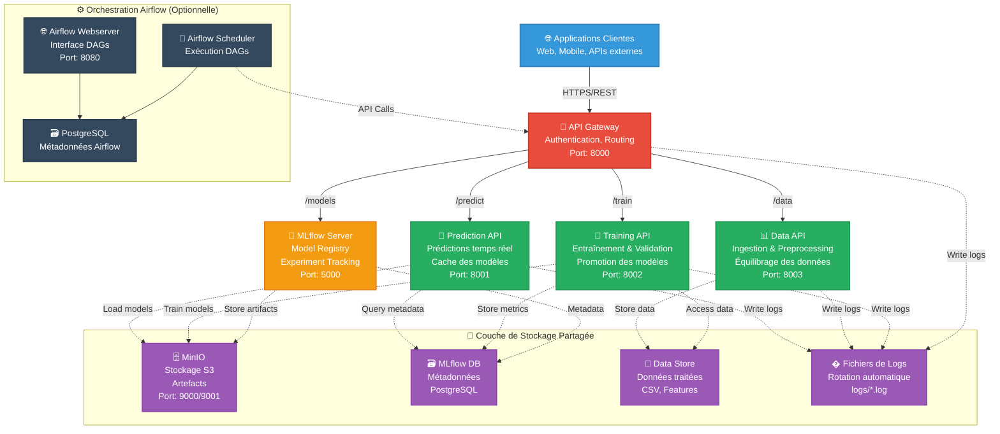

# Projet MLOps Datascientest - Analyse de Sentiments


**Projet de fin d'étude MLOps réalisé par Camille Hamel pour Datascientest**

## 📋 Table des Matières

1. [Introduction](#introduction)
2. [Architecture Technique](#architecture-technique)
3. [Composants du Système](#composants-du-système)
4. [Cycle de Vie MLOps](#cycle-de-vie-mlops)
5. [Fonctionnalités Avancées](#fonctionnalités-avancées)
6. [Installation et Déploiement](#installation-et-déploiement)
7. [Utilisation](#utilisation)
8. [API Reference](#api-reference)
9. [Configuration](#configuration)
10. [Documentation Technique](Documentation/INDEX.md)
11. [Troubleshooting](#troubleshooting)

## 🎯 Introduction

### Contexte du Projet

Ce projet de fin d'étude MLOps, réalisé dans le cadre de la formation Datascientest, présente une solution complète d'analyse de sentiments pour les avis clients TrustPilot. Il met en œuvre une architecture microservices moderne intégrant l'ensemble du cycle de vie MLOps, de l'ingestion des données à la mise en production des modèles.

### Objectifs

- **Automatisation complète** du pipeline MLOps
- **Architecture microservices** scalable et maintenable
- **Gestion de la traçabilité** des modèles et des données
- **Validation automatique** des modèles avant mise en production
- **Interface API REST** pour l'intégration dans des systèmes existants
- **Monitoring et logging** pour le suivi de la performance

### Stack Technique

- **Backend**: Python 3.10, FastAPI, Pandas, NumPy
- **Machine Learning**: TensorFlow/Keras, Scikit-learn, spaCy, NLTK
- **MLOps**: MLflow (tracking, registre de modèles)
- **Infrastructure**: Docker, Docker Compose
- **Stockage**: MinIO (S3-compatible), PostgreSQL
- **Orchestration**: Airflow
- **Authentification**: JWT (JSON Web Tokens)

## 🏗️ Architecture Technique

### Vue d'Ensemble



*Schéma de l'architecture microservices du système MLOps*

### Architecture Microservices

L'architecture suit les principes de l'architecture microservices avec une séparation claire des responsabilités :

#### 🌐 API Gateway (Port 8000)
- **Rôle** : Point d'entrée unique et orchestrateur
- **Responsabilités** : 
  - Authentification JWT
  - Routage des requêtes
  - Agrégation des réponses
  - Gestion des erreurs centralisée

#### 🔮 Prediction API (Port 8001)
- **Rôle** : Service de prédiction en temps réel
- **Responsabilités** :
  - Chargement des modèles depuis MLflow
  - Prédictions unitaires et par lots
  - Cache des modèles pour la performance

#### 📊 Data API (Port 8003)
- **Rôle** : Gestion des données et preprocessing
- **Responsabilités** :
  - Ingestion de fichiers CSV
  - Nettoyage et préprocessing
  - Gestion des jeux de données
  - Équilibrage des données déséquilibrées

#### 🤖 Training API (Port 8002)
- **Rôle** : Entraînement et validation des modèles
- **Responsabilités** :
  - Entraînement de nouveaux modèles
  - Validation automatique
  - Promotion en production
  - Gestion du cycle de vie des modèles

## 🔧 Composants du Système

### MLflow (Port 5000)
- **Tracking Server** : Suivi des expériences et métriques
- **Model Registry** : Gestion des versions de modèles
- **Artifact Store** : Stockage des modèles et artefacts

### MinIO (Port 9000/9001)
- **Stockage S3-compatible** pour les artefacts MLflow
- **Interface web** pour la gestion des fichiers
- **Haute disponibilité** et réplication

### Services Infrastructure
- **Monitoring** : Logs centralisés et métriques de santé
- **Authentification** : Système JWT avec rôles utilisateurs
- **Configuration** : Variables d'environnement centralisées

## � Documentation Technique

Pour une documentation technique complète, consultez le répertoire [`Documentation/`](Documentation/INDEX.md) qui contient :

- **[Architecture Microservices](Documentation/Architecture_Microservices.md)** - Détails techniques de l'architecture
- **[API Reference](Documentation/API_Reference.md)** - Guide complet des endpoints
- **[Docker Hub Deployment](Documentation/Docker_Hub_Deployment.md)** - Déploiement avec images pré-construites
- **[Docker Volumes Structure](Documentation/Docker_Volumes_Structure.md)** - Gestion des volumes persistants

## �🔄 Cycle de Vie MLOps

```mermaid
flowchart LR
    %% Data Ingestion
    subgraph Ingestion["📥 1. Ingestion des Données"]
        Upload[📤 Upload CSV]
        Validate[✅ Validation]
        Clean[🧹 Nettoyage]
        Store[💾 Stockage]
    end
    
    %% Training
    subgraph Training["🏋️ 2. Entraînement"]
        Select[🎯 Sélection données]
        Train[🤖 Entraînement]
        Evaluate[📊 Évaluation]
        Register[📝 Enregistrement]
    end
    
    %% Validation
    subgraph Validation["✅ 3. Validation"]
        TestModel[🧪 Test modèle]
        Compare[⚖️ Comparaison prod]
        Approve[👍 Approbation]
        Archive[📦 Archivage ancien]
    end
    
    %% Production
    subgraph Production["🚀 4. Production"]
        Promote[⬆️ Promotion]
        Deploy[🌐 Déploiement]
        Monitor[📈 Monitoring]
        Predict[🔮 Prédictions]
    end
    
    %% Optional Airflow Orchestration
    subgraph AirflowOrch["⚙️ Orchestration Airflow (Optionnelle)"]
        DAGs[📅 DAGs Airflow<br/>- mlops_data_ingestion_training<br/>- mlops_monitor_data]
        Scheduler[🕒 Scheduler]
    end
    
    %% Flow
    Upload --> Validate --> Clean --> Store
    Store --> Select --> Train --> Evaluate --> Register
    Register --> TestModel --> Compare --> Approve
    Approve --> Archive --> Promote --> Deploy --> Monitor
    Monitor --> Predict
    
    %% Back to training for continuous improvement
    Monitor -.->|Feedback| Select
    
    %% Airflow orchestration (optional)
    DAGs -.->|Trigger via API| Upload
    DAGs -.->|Trigger via API| Select
    Scheduler -.->|Schedule DAGs| DAGs
    
    %% Styling
    classDef ingestionStyle fill:#3498db,stroke:#2980b9,stroke-width:2px,color:#fff
    classDef trainingStyle fill:#27ae60,stroke:#229954,stroke-width:2px,color:#fff
    classDef validationStyle fill:#f39c12,stroke:#e67e22,stroke-width:2px,color:#fff
    classDef productionStyle fill:#e74c3c,stroke:#c0392b,stroke-width:2px,color:#fff
    classDef airflowStyle fill:#34495e,stroke:#2c3e50,stroke-width:2px,color:#fff
    
    class Upload,Validate,Clean,Store ingestionStyle
    class Select,Train,Evaluate,Register trainingStyle
    class TestModel,Compare,Approve,Archive validationStyle
    class Promote,Deploy,Monitor,Predict productionStyle
    class DAGs,Scheduler airflowStyle
```



### 1. 📥 Ingestion des Données

```
Fichier CSV → Data API → Validation → Preprocessing → Stockage MLflow
                ↓
            - Vérification des colonnes requises
            - Nettoyage des données
            - Extraction de features
            - Labélisation automatique
            - Tagging ("jdd entrainement" / "jdd validation")
```

**Fonctionnalités avancées** :
- Détection automatique d'encodage
- Gestion des caractères spéciaux
- Équilibrage des classes déséquilibrées
- Validation de qualité des données
- Métadonnées enrichies (nom personnalisé, nom de fichier original)

### 2. 🏋️ Entraînement des Modèles

```
Données → Training API → Entraînement → Validation → Enregistrement MLflow
            ↓
        - Sélection automatique des données
        - Configuration des hyperparamètres
        - Entraînement avec validation croisée
        - Calcul des métriques de performance
        - Tag "à valider"
```

**Caractéristiques** :
- Support des modèles de base (transfer learning)
- Hyperparamètre tuning automatique
- Validation robuste avec métriques complètes
- Traçabilité complète des expériences

### 3. ✅ Validation des Modèles

```
Modèle "à valider" → Évaluation → Comparaison → Décision → Action
                       ↓
                   - Test sur données de validation
                   - Comparaison avec modèle en production
                   - Critères de seuil configurable
                   - Validation automatique ou manuelle
```

**Critères de validation** :
- Seuil minimum d'accuracy
- Comparaison avec modèle en production
- Détection de régression significative
- Métriques complètes (precision, recall, F1-score)

### 4. 🚀 Promotion en Production

```
Modèle validé → Archivage ancien modèle → Promotion → Mise à jour Prediction API
                      ↓
                  - Ancien modèle → "None" + "archived"
                  - Nouveau modèle → "Production" + "production"
                  - Notification automatique
                  - Rechargement du service de prédiction
```

## ⚡ Fonctionnalités Avancées

### 🎯 Équilibrage des Données Déséquilibrées

Le système inclut un module spécialisé pour traiter les datasets fortement déséquilibrés (typiquement <1% d'avis négatifs) :

- **Stratégies disponibles** :
  - `undersample` : Réduction de la classe majoritaire
  - `oversample` : Augmentation de la classe minoritaire (SMOTE)
  - `hybrid` : Approche combinée (recommandée)

- **Configuration flexible** :
  - Ratio cible personnalisable
  - Seed pour reproductibilité
  - Validation des résultats

### 📊 Gestion Avancée des Métadonnées

- **Noms personnalisés** pour les datasets
- **Fichiers originaux** préservés
- **Traçabilité complète** des transformations
- **Statistiques enrichies** automatiques

### 🔒 Authentification et Sécurité

- **JWT avec expiration** configurable
- **Rôles utilisateur** (admin/user)
- **Validation des tokens** sur tous les endpoints
- **Logging de sécurité** pour audit

### 📈 Observabilité et Logs

**Système de logging centralisé** basé sur `logger_config.py` :

- **Fichiers de logs rotatifs** (rotation 10MB, 10 backups)
  - `logs/mlops_YYYYMMDD.log` - Logs généraux
  - `logs/mlops_errors_YYYYMMDD.log` - Erreurs uniquement
  - `logs/api_access_YYYYMMDD.log` - Accès API
  - `logs/api_general_YYYYMMDD.log` - Logs API généraux

- **Configuration avancée** :
  - Formatage standardisé avec timestamps
  - Niveaux configurables (DEBUG, INFO, WARNING, ERROR)
  - Logging par module (predict, train, api, data_ingestion)
  - Middleware de logging automatique sur toutes les requêtes

- **Métriques collectées** via les logs structurés :
  - Temps de réponse par endpoint
  - Performance des modèles (accuracy, temps prédiction)
  - Erreurs et exceptions avec stack traces
  - Volume et distribution des requêtes

> **Note** : Pas de solution externe (Prometheus/Grafana) - monitoring basé sur l'analyse des fichiers de logs.

## 🚀 Installation et Déploiement

### Prérequis

- **Docker** >= 20.10.0
- **Docker Compose** >= 2.0.0
- **Git** pour cloner le dépôt
- **Minimum 8GB RAM** recommandés
- **Ports disponibles** : 8000, 8001, 8002, 8003, 5000, 9000, 9001

### Installation Rapide

1. **Cloner le dépôt**
   ```bash
   git clone https://github.com/schwaxpl/Datascientest_projet_MLOps.git
   cd Datascientest_projet_MLOps
   ```

2. **Démarrer l'architecture complète**
   ```bash
   # Windows
   .\deploy-microservices.bat
   
   # Linux/Mac
   ./deploy-microservices.sh
   ```

3. **Vérifier le déploiement**
   ```bash
   docker-compose -f docker-compose-microservices.yml ps
   ```

### Démarrage Manuel

```bash
# Construction et démarrage
docker-compose -f docker-compose-microservices.yml up -d --build

# Vérification des logs
docker-compose -f docker-compose-microservices.yml logs -f

# Arrêt des services
docker-compose -f docker-compose-microservices.yml down
```

### Accès aux Interfaces

| Service | URL | Description |
|---------|-----|-------------|
| **API Gateway** | http://localhost:8000 | Point d'entrée principal |
| **Documentation API** | http://localhost:8000/docs | Interface Swagger |
| **MLflow UI** | http://localhost:5000 | Suivi des expériences |
| **MinIO Console** | http://localhost:9001 | Gestion des fichiers |

### Comptes par Défaut

| Rôle | Username | Password |
|------|----------|----------|
| Administrateur | `admin` | `adminpassword` |
| Utilisateur | `user` | `userpassword` |
| MinIO | `minio` | `minio123` |

## 📚 Utilisation

### 1. Authentification

Obtenir un token d'accès :

```bash
curl -X POST "http://localhost:8000/token" \
     -H "Content-Type: application/x-www-form-urlencoded" \
     -d "username=user&password=userpassword"
```

Réponse :
```json
{
  "access_token": "eyJhbGciOiJIUzI1NiIsInR5cCI6IkpXVCJ9...",
  "token_type": "bearer",
  "expires_in": 3600,
  "user_info": {
    "username": "user",
    "roles": ["user"]
  }
}
```

### 2. Upload de Données

**Données d'entraînement** :
```bash
curl -X POST "http://localhost:8000/data/upload" \
     -H "Authorization: Bearer <TOKEN>" \
     -F "file=@mon_dataset.csv" \
     -F "dataset_name=Mon Dataset Custom"
```

**Données de validation** :
```bash
curl -X POST "http://localhost:8000/data/upload/validation" \
     -H "Authorization: Bearer <TOKEN>" \
     -F "file=@validation_data.csv" \
     -F "dataset_name=Dataset Validation Custom"
```

### 3. Équilibrage des Données

Pour les datasets déséquilibrés :

```bash
curl -X POST "http://localhost:8000/data/datasets/balance" \
     -H "Authorization: Bearer <TOKEN>" \
     -F "dataset_id=<DATASET_ID>" \
     -F "strategy=hybrid" \
     -F "target_ratio=0.3" \
     -F "dataset_name=Dataset Équilibré"
```

### 4. Entraînement de Modèles

```bash
curl -X POST "http://localhost:8000/train" \
     -H "Authorization: Bearer <TOKEN>" \
     -F "run_id=<RUN_ID>" \
     -F "model_name=sentiment_model_v2"
```

### 5. Validation et Promotion

**Validation automatique** :
```bash
curl -X POST "http://localhost:8000/validate" \
     -H "Authorization: Bearer <TOKEN>" \
     -H "Content-Type: application/json" \
     -d '{
       "model_name": "sentiment_model_v2",
       "model_version": "1",
       "auto_approve": true,
       "threshold": 0.75
     }'
```

### 6. Prédiction

**Prédiction unitaire** :
```bash
curl -X POST "http://localhost:8000/predict" \
     -H "Authorization: Bearer <TOKEN>" \
     -F "text=Ce produit est vraiment excellent, je le recommande!"
```

**Prédiction par lots** :
```bash
curl -X POST "http://localhost:8000/predict/batch" \
     -H "Authorization: Bearer <TOKEN>" \
     -F "file=@textes_a_analyser.csv" \
     --output predictions.csv
```

## 📖 API Reference

### Endpoints Principaux

#### 🔐 Authentification
- `POST /token` - Obtenir un token JWT
- `GET /me` - Informations utilisateur

#### 📊 Gestion des Données
- `POST /data/upload` - Upload données d'entraînement
- `POST /data/upload/validation` - Upload données de validation
- `GET /data/datasets` - Liste des datasets
- `GET /data/datasets/{id}` - Détails d'un dataset
- `GET /data/datasets/{id}/download` - Télécharger un dataset
- `POST /data/datasets/balance` - Équilibrer un dataset

#### 🤖 Modèles et Entraînement
- `POST /train` - Entraîner un nouveau modèle
- `POST /validate` - Valider un modèle
- `POST /promote/{model}/{version}` - Promouvoir un modèle
- `GET /models` - Liste des modèles disponibles

#### 🔮 Prédiction
- `POST /predict` - Prédiction unitaire
- `POST /predict/batch` - Prédiction par lots

#### 🏥 Monitoring
- `GET /health` - État de santé des services

### Format des Données d'Entrée

**Fichiers CSV requis** :
- Colonne `Avis` : Texte de l'avis client
- Colonne `Note` : Note numérique (1-5)
- Encodage : UTF-8 recommandé
- Séparateur : Virgule ou point-virgule

**Exemple** :
```csv
Avis,Note
"Excellent produit, très satisfait",5
"Qualité décevante, ne recommande pas",2
"Correct sans plus",3
```

## ⚙️ Configuration

### Variables d'Environnement

#### Authentification
```bash
SECRET_KEY=your-secret-key-here
ACCESS_TOKEN_EXPIRE_MINUTES=60

# Comptes utilisateurs
ADMIN_USERNAME=admin
ADMIN_PASSWORD=adminpassword
USER_USERNAME=user
USER_PASSWORD=userpassword
```

#### Services MLOps
```bash
# MLflow
MLFLOW_TRACKING_URI=http://mlflow:5000
MLFLOW_S3_ENDPOINT_URL=http://minio:9000

# MinIO (S3)
AWS_ACCESS_KEY_ID=minio
AWS_SECRET_ACCESS_KEY=minio123
MLFLOW_S3_BUCKET=mlflow

# URLs des microservices
PREDICTION_API_URL=http://prediction-api:8001
TRAINING_API_URL=http://training-api:8002
DATA_API_URL=http://data-api:8003
```

#### Configuration Avancée
```bash
# Seuils de validation
DEFAULT_VALIDATION_THRESHOLD=0.75
REGRESSION_TOLERANCE=0.01

# Performance
MODEL_CACHE_SIZE=3
BATCH_SIZE=32
MAX_FEATURES=5000
```

### Personnalisation

#### Modification des Seuils
Editez le fichier `src/config.py` :
```python
# Seuil de validation par défaut
DEFAULT_VALIDATION_THRESHOLD = 0.80

# Tolérance de régression
REGRESSION_TOLERANCE = 0.02

# Configuration du preprocessing
POSITIVE_REVIEW_THRESHOLD = 3
```

#### Ajout de Nouveaux Algorithmes
1. Créer un nouveau module dans `src/models/`
2. Implémenter l'interface `BaseModel`
3. Enregistrer dans `src/train.py`

## 🔧 Troubleshooting

### Problèmes Courants

#### 🐳 Services ne démarrent pas
```bash
# Vérifier les logs
docker-compose -f docker-compose-microservices.yml logs

# Redémarrer complètement
docker-compose -f docker-compose-microservices.yml down
docker-compose -f docker-compose-microservices.yml up -d --build
```

#### 🔐 Erreurs d'authentification
```bash
# Vérifier les variables d'environnement
docker-compose -f docker-compose-microservices.yml exec gateway-api env | grep -E "(USERNAME|PASSWORD)"

# Régénérer un token
curl -X POST "http://localhost:8000/token" \
     -H "Content-Type: application/x-www-form-urlencoded" \
     -d "username=user&password=userpassword"
```

#### 📊 MLflow inaccessible
```bash
# Vérifier le service MLflow
docker-compose -f docker-compose-microservices.yml exec mlflow-server ps aux

# Réinitialiser MLflow
docker-compose -f docker-compose-microservices.yml restart mlflow-server
```

#### 🧠 Modèles non trouvés
```bash
# Vérifier le registre MLflow
curl "http://localhost:5000/api/2.0/mlflow/registered-models/list"

# Vérifier les artefacts MinIO
# Accéder à http://localhost:9001
```

### Logs et Debugging

#### Accéder aux Logs
```bash
# Logs de tous les services
docker-compose -f docker-compose-microservices.yml logs -f

# Logs d'un service spécifique
docker-compose -f docker-compose-microservices.yml logs -f gateway-api
docker-compose -f docker-compose-microservices.yml logs -f training-api
```

#### Monitoring en Temps Réel
```bash
# État des services
curl "http://localhost:8000/health"

# Métriques système
docker stats

# Utilisation des volumes
docker system df
```

### Réinitialisation Complète

En cas de problème majeur :

```bash
# Arrêter tous les services
docker-compose -f docker-compose-microservices.yml down

# Supprimer les volumes (⚠️ Perte de données)
docker-compose -f docker-compose-microservices.yml down -v

# Nettoyer les images
docker system prune -a

# Redémarrer proprement
docker-compose -f docker-compose-microservices.yml up -d --build
```

---

## 👨‍💻 Auteur

**Camille Hamel**  
Projet de fin d'étude MLOps - Datascientest  
📧 [Contact](mailto:camille.hamel@example.com)

## 📄 Licence

Ce projet est sous licence MIT. Voir le fichier [LICENSE](LICENSE) pour plus de détails.

## 🤝 Contribution

Les contributions sont les bienvenues ! Pour contribuer :

1. Fork le projet
2. Créer une branche feature (`git checkout -b feature/AmazingFeature`)
3. Commit les changements (`git commit -m 'Add some AmazingFeature'`)
4. Push vers la branche (`git push origin feature/AmazingFeature`)
5. Ouvrir une Pull Request

## 📚 Références

- [MLflow Documentation](https://mlflow.org/docs/latest/index.html)
- [FastAPI Documentation](https://fastapi.tiangolo.com/)
- [Docker Compose Reference](https://docs.docker.com/compose/)
- [TensorFlow Guide](https://www.tensorflow.org/guide)

---

*Dernière mise à jour : Septembre 2025*
