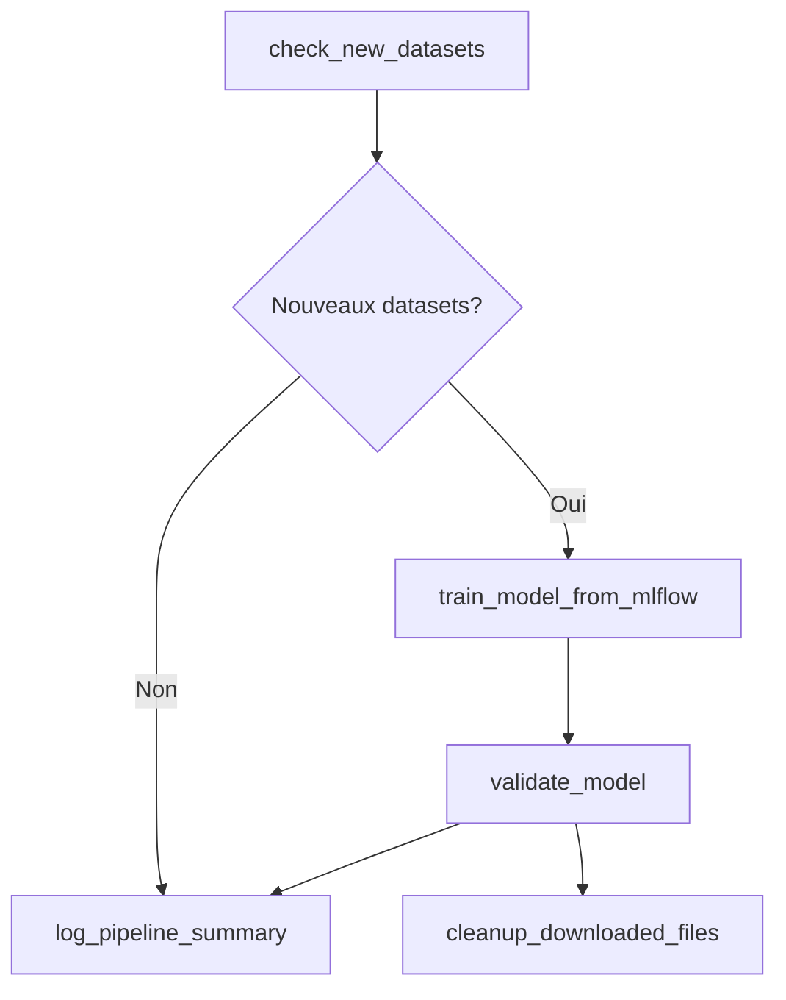

# MLOps Automated Training DAG

## Vue d'ensemble

Ce DAG surveille automatiquement MLflow pour détecter de nouveaux datasets et déclenche l'entraînement de modèles en temps réel.

## Fonctionnement

### Principe
- **Fréquence** : Exécution toutes les minutes
- **Déclencheur** : Nouveaux datasets dans MLflow (dernière minute)
- **Traitement** : Entraînement direct via run_id MLflow (pas de téléchargement de fichiers)

### Workflow



## Tâches du DAG

### 1. `check_new_datasets`
- Surveille MLflow pour les nouveaux runs créés dans la dernière minute
- Cherche les artifacts de type CSV ou dataset
- Sélectionne le dataset le plus récent si plusieurs sont trouvés

### 2. `train_model_from_mlflow`
- Lance l'entraînement directement avec le `run_id` MLflow détecté
- Génère automatiquement un nom de modèle basé sur l'expérience et le run
- Utilise l'API de training avec le `run_id` MLflow (pas de téléchargement)

### 3. `validate_model`
- Valide automatiquement le modèle entraîné
- Auto-approve activé pour les pipelines automatisés

### 4. `log_pipeline_summary`
- Log structuré des résultats du pipeline
- Inclut les métadonnées MLflow et les informations du modèle

### 5. `cleanup_downloaded_files`
- Tâche dummy (aucun fichier n'est téléchargé)

## Configuration

### Variables Airflow
- `MLFLOW_TRACKING_URI` : URI du serveur MLflow (défaut: `http://mlflow:5000`)
- `GATEWAY_API_URL` : URL de la Gateway API (défaut: `http://gateway-api:8000`)

### Paramètres du DAG
- **Schedule** : `timedelta(minutes=1)`
- **Max active runs** : 1 (évite les exécutions concurrentes)
- **Catchup** : False

## Avantages de cette approche

### 🚀 Performance
- Pas de téléchargement/upload de fichiers
- Utilisation directe des run_ids MLflow
- Pipeline plus rapide et efficient

### 🔄 Automatisation
- Détection automatique des nouveaux datasets
- Entraînement immédiat (moins d'1 minute de latence)
- Aucune intervention manuelle requise

### 📊 Traçabilité
- Lien direct entre le dataset MLflow source et le modèle
- Logs détaillés avec métadonnées complètes
- Nommage automatique des modèles avec contexte

## Utilisation

### Pour déclencher l'entraînement automatique :
1. Uploader un dataset dans MLflow (via l'API Data ou manuellement)
2. Le DAG détectera automatiquement le nouveau dataset dans la minute
3. L'entraînement se lancera automatiquement
4. Le modèle sera validé et disponible

### Exemple de nom de modèle généré :
```
auto_sentiment_analysis_a1b2c3d4_20250903_1430
```
Format : `auto_{experiment_name}_{run_id_short}_{timestamp}`

## Monitoring

### Logs à surveiller
- `check_new_datasets` : Nouveaux datasets détectés
- `train_model_from_mlflow` : Progression de l'entraînement
- `log_pipeline_summary` : Résumé complet du pipeline

### Alertes
- Échecs d'entraînement
- Problèmes de connexion MLflow
- Modèles en échec de validation

## Intégration

Ce DAG s'intègre parfaitement avec :
- **MLflow** : Source de données automatique
- **API Training** : Entraînement direct via run_id
- **Gateway API** : Authentification et routage
- **DAG Health Check** : Monitoring de l'infrastructure
