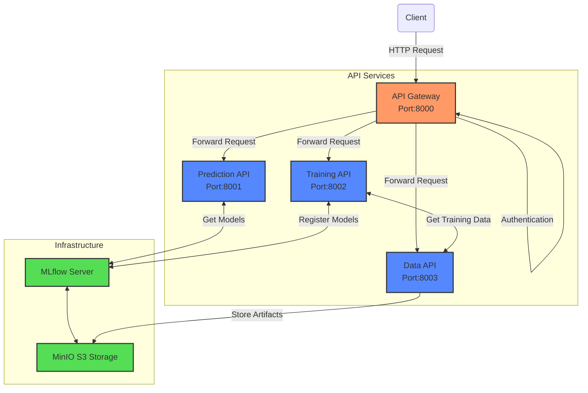

```mermaid
graph TD
    Client(Client) -->|HTTP Request| Gateway

    subgraph "Infrastructure"
        MLflow[MLflow Server]
        MinIO[MinIO S3 Storage]
        MLflow <--> MinIO
    end
    
    subgraph "API Services"
        Gateway[API Gateway\nPort:8000]
        Prediction[Prediction API\nPort:8001]
        Training[Training API\nPort:8002]
        Data[Data API\nPort:8003]
    end
    
    Gateway -->|Authentication| Gateway
    Gateway -->|Forward Request| Prediction
    Gateway -->|Forward Request| Training
    Gateway -->|Forward Request| Data
    
    Prediction <-->|Get Models| MLflow
    Training <-->|Register Models| MLflow
    Training <-->|Get Training Data| Data
    Data -->|Store Artifacts| MinIO
    
    classDef gateway fill:#f96,stroke:#333,stroke-width:2px;
    classDef service fill:#58f,stroke:#333,stroke-width:2px;
    classDef infra fill:#5d5,stroke:#333,stroke-width:2px;
    
    class Gateway gateway;
    class Prediction,Training,Data service;
    class MLflow,MinIO infra;
```
